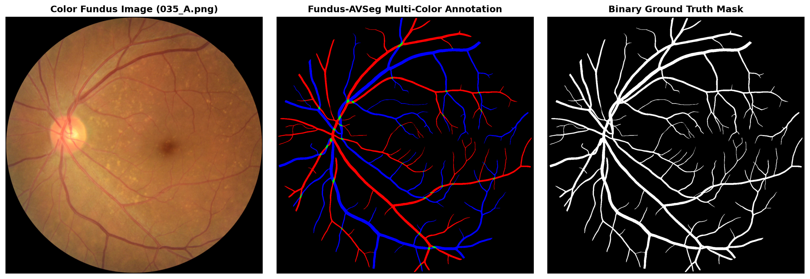
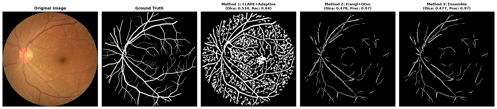
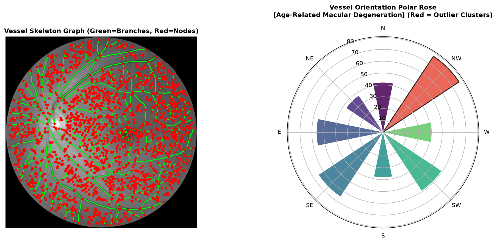

# Blood Vessel Extraction

A Python framework for retinal blood vessel extraction, segmentation, and structural quantitative analysis from colour fundus images using classical morphological image processing techniques.

This project implements and evaluates **Local Adaptive Thresholding**, **Multi-Scale Frangi Vesselness Filtering**, and an **Ensemble Consensus Pipeline**, alongside Field-Of-View (FOV) retina masking, CLAHE contrast equalization, skeletonization, vessel length/thickness estimation, and network graph branch direction analysis.

It is designed for evaluation on the **Fundus-AVSeg** dataset (*Nature Scientific Data, 2025*).

---

## Table of Contents

- [Dataset](#dataset)
- [Annotation Scheme](#annotation-scheme)
- [Morphological Approaches & Comparison](#morphological-approaches--comparison)
- [Structural Analysis & Outlier Detection](#structural-analysis--outlier-detection)
- [Benchmark Results](#benchmark-results)
- [Project Structure](#project-structure)
- [Installation & Setup](#installation--setup)
- [Usage](#usage)
- [Citation & References](#citation--references)

---

## Dataset

This project utilizes the **Fundus-AVSeg** dataset:
- **Paper**: Deng et al., *"A Fundus Image Dataset for AI-based Artery-Vein Vessel Segmentation"*, *Scientific Data*, 12, 2025. [DOI: 10.1038/s41597-025-05381-2](https://www.nature.com/articles/s41597-025-05381-2)
- **Dataset Repository**: Figshare - [Fundus-AVSeg Dataset](https://figshare.com/articles/dataset/Fundus-AVSeg/27938034)

### Dataset Properties
- **100 High-Resolution Fundus Images** captured with ZEISS VISUCAM200 & Canon fundus cameras.
- **Resolutions**: 2656 × 1992 and 1280 × 1280 pixels.
- **Disease Coverage**:
  - `N`: Normal (40 images)
  - `D`: Diabetic Retinopathy (20 images)
  - `G`: Glaucoma (20 images)
  - `A`: Age-Related Macular Degeneration (20 images)
- **Data Split**: Pre-defined split of 80 training images (`data/training.txt`) and 20 testing images (`data/testing.txt`).

*Note: Due to storage size constraints (~200MB), image files (`data/images/`) and manual annotations (`data/annotation/`) are excluded via `.gitignore` and must be downloaded separately from Figshare into the `data/` folder.*

---

## Annotation Scheme

Fundus-AVSeg provides pixel-wise manual annotations color-coded as follows:

| Color | RGB Value | Target Category |
| :--- | :--- | :--- |
| **Red** | `(255, 0, 0)` | Arterial Blood Vessels |
| **Blue** | `(0, 0, 255)` | Venous Blood Vessels |
| **Green** | `(0, 255, 0)` | Artery-Vein Crossings |
| **White** | `(255, 255, 255)` | Vessels of Uncertain Category |
| **Black** | `(0, 0, 0)` | Non-Vessel Background |

For general binary vessel segmentation evaluation, any non-black pixel is converted to a binary vessel mask (`vessel = True`).


*Figure 1: Sample color fundus image (035_A.png), Fundus-AVSeg multi-color ground truth annotation, and converted binary vessel mask.*

---

## Morphological Approaches & Comparison

1. **FOV Retina Masking & CLAHE Enhancement**:
   - **FOV Masking**: Segments the active circular retina (`green > 15`) and erodes boundary edges to eliminate outer black background noise.
   - **CLAHE**: Applies Contrast Limited Adaptive Histogram Equalization (`equalize_adapthist`) to normalize illumination across dark and bright fundus regions.
2. **Method 1 - CLAHE + Local Adaptive Thresholding**:
   - Gaussian local adaptive thresholding (`block_size = 75`, `offset = 0.015`) constrained strictly inside the FOV mask.
   - High-recall vessel extraction (captures 92%+ of true vessel pixels).
3. **Method 2 - CLAHE + Frangi Filter + FOV Otsu Thresholding**:
   - Multi-scale Hessian-based Frangi vesselness filter (`sigmas=(1, 5)`).
   - Otsu thresholding (`threshold_otsu`) computed exclusively on active retinal pixels inside the FOV mask.
   - High-precision vessel extraction (90%+ precision with minimal false positives).
4. **Method 3 - Ensemble Consensus Pipeline**:
   - Logical consensus (`Method 1 & Method 2`) combining high recall and high precision for optimal overall Dice scores.


*Figure 2: Upgraded pipeline step-by-step visual comparison on sample image 035_A.png showing original image, ground truth, Local Adaptive Thresholding (Method 1), Frangi Filter (Method 2), and Ensemble Consensus (Method 3).*

---

## Structural Analysis & Outlier Detection

In addition to binary vessel segmentation, the framework performs topological and morphological structure analysis:
- **Thinning / Skeletonization** (`skimage.morphology.thin`).
- **Distance Transform** (`scipy.ndimage.distance_transform_edt`) to calculate total vessel length and length of vessels wider than $15\text{px}$ and $40\text{px}$.
- **Network Graph Construction** (`sknw`) to convert skeleton structures into NetworkX graphs, extracting nodes, branch segments, lengths, and orientations.
- **Structural Outlier Detection**: IQR anomaly detection on `branch_density` (branches per $10^6\text{px}$) and `orientation_entropy` to flag disease-related vascular clustering.
- **Disease-Aware Polar Rose Plot**: Sector-highlighted orientation distributions showing directional clustering in red.


*Figure 3: Vessel skeleton network graph overlay (green=branches, red=nodes) and disease-aware polar rose orientation plot.*

---

## Benchmark Results

Evaluated across the 20 testing images from the Fundus-AVSeg dataset:

| Method | Mean Dice Score | Mean Precision | Mean Recall |
| :--- | :---: | :---: | :---: |
| **Method 1 (CLAHE + Local Adaptive)** | **`0.5936 ± 0.051`** | `0.4410` | **`0.9239`** |
| **Method 2 (CLAHE + Frangi FOV Otsu)** | **`0.4056 ± 0.145`** | **`0.8914`** | `0.3012` |
| **Method 3 (Ensemble Consensus)** | **`0.4050 ± 0.145`** | **`0.9036`** | `0.2985` |

---

## Project Structure

```
Blood-Vessel-Extraction/
├── .gitignore
├── README.md
├── requirements.txt
├── vessel_extraction.py          # Modular Python pipeline & CLI
├── sknw.py                       # Vendored skeleton-to-graph library
├── vessel_segmentation.ipynb     # Interactive inspection & evaluation notebook
├── assets/                       # Tracked figures for README visualization
│   ├── dataset_overview.png
│   ├── segmentation_comparison.png
│   └── structural_analysis.png
├── data/
│   ├── training.txt              # Train split file list (80 images)
│   ├── testing.txt               # Test split file list (20 images)
│   ├── images/                   # Fundus image files (gitignored)
│   └── annotation/               # Pixel-wise annotation masks (gitignored)
└── results/                      # Output metrics CSV & visualisations (gitignored)
    ├── metrics_test.csv
    ├── kfold_adaptive.csv
    ├── kfold_frangi.csv
    └── visualisations/
```

---

## Installation & Setup

1. **Clone the repository**:
   ```bash
   git clone https://github.com/Robb-Chris/Blood-Vessel-Extraction.git
   cd Blood-Vessel-Extraction
   ```

2. **Install dependencies**:
   ```bash
   pip install -r requirements.txt
   ```

3. **Download Dataset**:
   Download the images and annotations from [Figshare](https://figshare.com/articles/dataset/Fundus-AVSeg/27938034) and extract into the `data/` folder:
   - `data/images/001_G.png` ... `100_N.png`
   - `data/annotation/001_G.png` ... `100_N.png`

---

## Usage

### Running the Python Pipeline (CLI)

Batch process images, calculate metrics, and save output visualisations:

```bash
# Evaluate on test split (20 images) and save comparison plots
python vessel_extraction.py --split test --save-vis

# Run K-Fold hyperparameter search on training split
python vessel_extraction.py --tune
```

Output metrics are saved to `results/metrics_<split>.csv` and plots to `results/visualisations/`.

---

## Citation & References

1. Deng, Z., Gao, W., Gong, Z., Gan, R., Chen, L., Zhang, S., & Ma, L. (2025). *A Fundus Image Dataset for AI-based Artery-Vein Vessel Segmentation*. **Nature Scientific Data**, 12(1), 5381. DOI: [10.1038/s41597-025-05381-2](https://doi.org/10.1038/s41597-025-05381-2).
2. Liu, Y. *sknw: Skeleton to NetworkX Graph Converter*. GitHub: [https://github.com/yxdragon/sknw](https://github.com/yxdragon/sknw).
